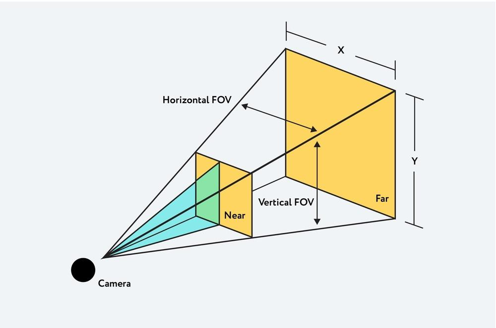

# Welcome to threejs 👋

> Threejs

## Install

```sh
$ npm create vite@latest threejs -- --template vanilla
$ npm install three
```

## Usage

```sh
$ npm run dev
```

## Reference



## Author

👤 **Kevin Ahn**

* Github: [@seung-seop-ahn](https://github.com/seung-seop-ahn)
* LinkedIn: [@seung-seop-ahn](https://linkedin.com/in/seung-seop-ahn)
